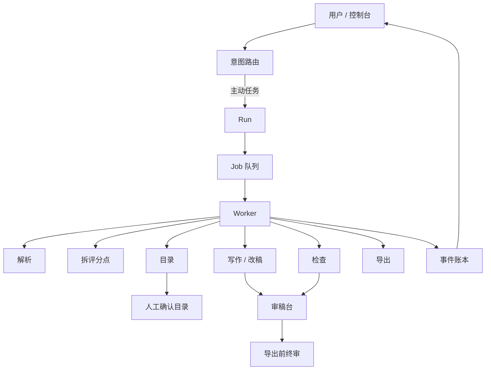

<p align="center">
  
</p>

<h1 align="center">wenbiao</h1>

<p align="center">
  <strong>标书评分点拆解 Prompt</strong> + 招标文件解析 / 技术标目录 / 分章草稿工作流<br/>
  开源套件 · MIT · 产品：<a href="https://aiwenbiao.cn">文标 aiwenbiao.cn</a>
</p>

<p align="center">
  <a href="#招标文件拆评分点完整工作流">完整工作流</a> ·
  <a href="#可复制-prompt-套件">可复制 Prompt</a> ·
  <a href="#示例输入与示例输出">示例</a> ·
  <a href="docs/harness-agent.md">harness agent</a> ·
  <a href="LICENSE">MIT</a>
</p>

<p align="center">
  <a href="https://github.com/hanbon-labs/wenbiao"></a>
  <a href="https://github.com/hanbon-labs/wenbiao/network/members"></a>
  <a href="https://github.com/hanbon-labs/wenbiao/watchers"></a>
  <a href="LICENSE"></a>
</p>

---

## 这个仓库解决什么问题

很多人搜 **「标书 评分点 拆解 prompt」**、**「招标文件怎么拆评分点」**、**「AI 写技术标先拆点」**，真正缺的不是一篇空话教程，而是：

1. 一套可复用的阶段顺序（先拆后写）
2. 每阶段可直接粘贴进 DeepSeek / GPT / Claude 的 Prompt
3. 一份虚构评分表 + 拆解表示例，能照着练

本仓库就是干这个的。产品名是 **文标**；仓库名是 **wenbiao**。  
若你要「上传招标文件 → 自动拆点 → 分章写 → 导出 Word」，请用官网：[https://aiwenbiao.cn](https://aiwenbiao.cn)

> 红线：AI 输出只是草稿，须人工审核；不保证中标；不编造资质/业绩/检测编号。
如果这套工作流对你有帮助，欢迎 [Star](https://github.com/hanbon-labs/wenbiao) / [Fork](https://github.com/hanbon-labs/wenbiao/fork)——详见下文「如果觉得有用」。


---

## 招标文件拆评分点完整工作流

把「一份招标」变成「可写章节」，推荐固定跑这 5 步（不要跳步一次生成全书）：

| 步骤 | 做什么 | Prompt 文件 | 产出 |
| --- | --- | --- | --- |
| 1 | 招标文件解析 | [prompts/01-tender-parse.md](prompts/01-tender-parse.md) | 废标项、评分摘要、待确认清单 |
| 2 | **评分点拆解**（核心） | [prompts/02-score-points.md](prompts/02-score-points.md) | 可写章节表 + Top5 高分项 |
| 3 | 技术标目录 | [prompts/03-catalog-outline.md](prompts/03-catalog-outline.md) | 目录 + 评分点对照表 |
| 4 | 单章草稿 | [prompts/04-chapter-draft.md](prompts/04-chapter-draft.md) | 一章一章写，缺事实写「待补」 |
| 5 | 提交前风险检查 | [prompts/05-risk-check.md](prompts/05-risk-check.md) | 废标对照 / 覆盖 / 人工必核 Top10 |

### 为什么必须先拆评分点

| 先写后对分 | 先拆评分点再写 |
| --- | --- |
| 章节好看但对不上分 | 每章挂评分点 ID |
| 高分项漏响应 | Top5 先写 |
| 模型容易空编业绩 | 「待补」占位，不编造 |
| 返工成本高 | 目录确认后再扩写 |

站内方法文（与本仓库互证）：

- [拆评分点方法](https://aiwenbiao.cn/guides/split-score-points)
- [技术标怎么写](https://aiwenbiao.cn/guides/how-to-write-tech-bid)
- [半天写出技术标首稿](https://aiwenbiao.cn/guides/half-day-first-draft)

---

## 10 分钟快速开始（复制即用）

1. 打开虚构评分表：[examples/sample-score-table.md](examples/sample-score-table.md)
2. 复制 [prompts/02-score-points.md](prompts/02-score-points.md) 里的 System + User
3. 把评分表贴到 User 末尾，发给任意 LLM
4. 对照示例输出：[examples/sample-score-breakdown.md](examples/sample-score-breakdown.md)
5. 把拆解表贴进 [03](prompts/03-catalog-outline.md) 生成目录，再用 [04](prompts/04-chapter-draft.md) **一次只写一章**

---

## 可复制 Prompt 套件

每个文件都含 **System** 与 **User** 模板，可整段复制。

### 02 · 标书评分点拆解 Prompt（最常用）

完整版见文件；核心要求摘要：

```text
你是技术标评分点拆解助手。目标是把每一条评分点变成可执行的写作任务。
规则：不写大段正文；不编造企业业绩与资质；客观分/主观分分开标注；输出 Markdown 表。

请根据评分表输出：
| ID | 评分项 | 分值 | 类型(客观/主观) | 建议章节 | 需要的证据类型 | 原文摘录 | 风险备注 |

再给出：Top5 高分项；最容易废标或失分的 3 条；建议的章节优先顺序。
```

其余阶段：

- 01 解析：[prompts/01-tender-parse.md](prompts/01-tender-parse.md)
- 03 目录：[prompts/03-catalog-outline.md](prompts/03-catalog-outline.md)
- 04 单章：[prompts/04-chapter-draft.md](prompts/04-chapter-draft.md)
- 05 检查：[prompts/05-risk-check.md](prompts/05-risk-check.md)

---

## 示例输入与示例输出

- **输入（虚构评分表）**：[examples/sample-score-table.md](examples/sample-score-table.md)
- **输出（拆解表示例）**：[examples/sample-score-breakdown.md](examples/sample-score-breakdown.md)

练习关键词（方便 GitHub / 搜索引擎检索）：标书评分点拆解、招标评分办法拆解、技术标评分点 Prompt、AI 写标书先拆点、tender score breakdown prompt。

---

## harness agent（产品侧架构标签）

**harness agent** 是工作流架构标签，不是英文产品名。产品正式名称是 **文标**。

> Harness Agent = 意图路由 + 阶段化 Run/Job + Worker 执行 + 事件可观测 + 人工审稿闸口。

六步：招标解析 → 评分拆解 → 目录审定 → 标书写作 → 废标检查 → 交付导出。

三道人工闸口：目录确认 → 章节审稿 → 导出前终审。

详解与架构图：[docs/harness-agent.md](docs/harness-agent.md)



---

## 仓库结构

```text
wenbiao/
  README.md                 # 本页：工作流 + Prompt 入口
  docs/harness-agent.md     # harness 架构详解
  docs/methodology.md       # 技术标 6 步摘要
  prompts/01..05            # 各阶段可复制 Prompt
  examples/                 # 虚构评分表 + 拆解示例
  assets/og-card.png        # 文标分享图
```

---

## 与文标产品

| | 本仓库 | [文标](https://aiwenbiao.cn) |
| --- | --- | --- |
| 重点 | 评分点拆解 Prompt + 阶段工作流说明 | 在线 harness agent |
| 适用 | 自学、团队复用、接入自有 LLM | 上传招标文件 → 拆点 → 分章 → 导出 |
| 许可 | MIT | 产品服务条款 |

---

## 红线（必读）

1. AI 输出只是 **草稿**，须 **人工审核**
2. **不保证中标**
3. **不编造** 资质、业绩、设备参数、合同编号等事实
4. 密件、审批、价格以你司合规流程为准

---

## 如果觉得有用

这套「先拆评分点、再写技术标」的 Prompt 工作流是开源的（MIT）。若它帮你省掉一次返工或找到可用的拆解顺序：

1. **Star** 一下本仓库（右上角）——方便以后找回，也让更多做标书的人搜到
2. **Fork** 到自己账号——按行业/公司口径改 Prompt，不用从零搭
3. **Watch** → Custom（可选 Releases）——看新版本与示例更新
4. 有场景或改进意见：开 [Issue](https://github.com/hanbon-labs/wenbiao/issues) 或 [Discussion](https://github.com/hanbon-labs/wenbiao/discussions)

> Star / Fork 不收费，也不等于保证中标；AI 草稿仍须人工审核。

## 友链 / 社区认可

本项目积极参与并认可 [LINUX DO](https://linux.do) 社区（[linux.do](https://linux.do)）。

---

## 贡献 / License / Links

欢迎补充更稳的 Prompt、虚构示例与文档勘误，见 [CONTRIBUTING.md](CONTRIBUTING.md)。

[MIT](LICENSE)

- 官网：https://aiwenbiao.cn
- GitHub：https://github.com/hanbon-labs/wenbiao
- 拆评分点方法：https://aiwenbiao.cn/guides/split-score-points
- 技术标怎么写：https://aiwenbiao.cn/guides/how-to-write-tech-bid
- 官方渠道：https://aiwenbiao.cn/sources
- LINUX DO：https://linux.do
