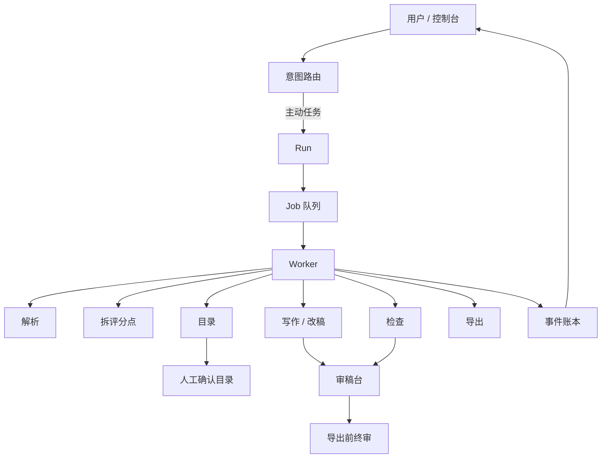

  

  

<h1 align="center">wenbiao-open-prompts</h1>

  <strong>文标开源</strong>：面向招投标的 <strong>harness agent</strong> 工作流说明 
  + 招标解析 / 评分点拆解 / 目录与章节草稿 Prompt 套件

  <a href="https://aiwenbiao.cn">官网</a> ·
  <a href="docs/harness-agent.md">harness agent 详解</a> ·
  <a href="https://aiwenbiao.cn/guides">方法文</a> ·
  <a href="LICENSE">MIT</a>

---

## 重点：什么是 harness agent

**harness agent** 是工作流架构标签，不是英文产品名。产品正式名称是 **文标**（[aiwenbiao.cn](https://aiwenbiao.cn)）。

一句话：

> **Harness Agent = 意图路由 + 阶段化 Run/Job + Worker 执行 + 事件可观测 + 人工审稿闸口。**

它把写标书从「一个聊天框生成全书」，改成可排队、可取消、可人工介入的六步工作流：

**招标解析 → 评分拆解 → 目录审定 → 标书写作 → 废标检查 → 交付导出**

完整架构图、时序图、组件说明见：

**[docs/harness-agent.md](docs/harness-agent.md)**（建议先读这一篇）

### 总览图

### 为什么不是纯聊天框

| 纯聊天框 | harness agent |
| --- | --- |
| 一次生成全书，结构偏了全盘返工 | 先拆点、先目录，再分章写 |
| 中断难恢复 | Run / Job 可排队、可重试 |
| 看不清进度 | 事件账本可观测 |
| 易编造事实 | 人工闸口 + 待补占位 |
| 责任边界模糊 | 草稿须人审；不保证中标 |

### 三道人工闸口（不可跳过）

1. **目录确认**：未确认不进入全书写作  
2. **章节审稿**：草稿可改、可留版本  
3. **导出前终审**：检查只给线索，不做「一定能过」承诺  

---

## 本仓库还提供什么

在理解 harness 之后，你可以用本仓库的 **阶段 Prompt**，在任意 LLM（DeepSeek / GPT / Claude / 本地模型）里手工复现同一套方法：

| 阶段 | Prompt |
| --- | --- |
| 解析 | [prompts/01-tender-parse.md](prompts/01-tender-parse.md) |
| 拆评分点 | [prompts/02-score-points.md](prompts/02-score-points.md) |
| 目录 | [prompts/03-catalog-outline.md](prompts/03-catalog-outline.md) |
| 单章草稿 | [prompts/04-chapter-draft.md](prompts/04-chapter-draft.md) |
| 风险检查 | [prompts/05-risk-check.md](prompts/05-risk-check.md) |

若需要「上传招标文件 → 自动跑完 harness → 导出 Word」的在线产品，请直接用：**[https://aiwenbiao.cn](https://aiwenbiao.cn)**

---

## 仓库结构

- `docs/harness-agent.md`：harness agent 架构与详细介绍（**重点**）
- `docs/methodology.md`：技术标 6 步方法论摘要
- `assets/og-card.png`：文标分享图（OG）
- `assets/icon.png`：文标分享方图
- `assets/logo.svg` / `assets/logo.png`：品牌标
- `prompts/01`～`05`：各阶段 Prompt
- `examples/sample-score-table.md`：虚构示例评分表
- `CONTRIBUTING.md` / `LICENSE`

---

## 快速开始

### A. 先读架构（推荐）

1. 打开 [docs/harness-agent.md](docs/harness-agent.md)
2. 看懂：意图路由 → Run → Job → Worker → 人工闸口
3. 再决定用官网产品，还是用本仓库 Prompt 自学

### B. 用 Prompt 手工跑通一遍

1. 练手打开 [examples/sample-score-table.md](examples/sample-score-table.md)
2. 用 [02-score-points.md](prompts/02-score-points.md) 拆点
3. 用 [03-catalog-outline.md](prompts/03-catalog-outline.md) 定目录
4. 用 [04-chapter-draft.md](prompts/04-chapter-draft.md) **一次只写一章**
5. 用 [05-risk-check.md](prompts/05-risk-check.md) 做提交前检查

---

## 各 Prompt 简要

### 01 招标文件解析

抽取基本信息、废标/否决项、响应表、评分摘要、交付与工期、待确认清单。  
**只解析，不写正文。**

### 02 评分点拆解

输出可写章节表：ID、评分项、分值、类型、建议章节、证据类型、摘录、风险。  
再附 Top5 高分项与易失分项。

### 03 技术标目录

目录必须回指评分点；含字数区间与对照表。  
**先结构，后文字。**

### 04 单章草稿

按章写作；缺事实用「待补」占位；禁止编造资质/合同/检测编号。

### 05 提交前风险检查

废标对照、高分覆盖、硬伤快检、人工必核 Top10。  
**不是法律意见。**

---

## 使用建议

- **先 harness，后 Prompt**：先理解阶段机，再复制提示词
- **模型**：解析/拆分用稳；草稿可稍活泼，但仍须人改
- **分段输入**：标书过长时，先贴评分办法与废标章
- **产出存档**：每阶段输出存独立 Markdown，便于回溯

---

## 红线（必读）

1. AI 输出只是 **草稿**，须 **人工审核**
2. **不保证中标**
3. **不编造** 资质、业绩、设备参数、合同编号等事实
4. 密件、审批、价格以你司合规流程为准

---

## 与文标产品

| | 本仓库 | [文标](https://aiwenbiao.cn) |
| --- | --- | --- |
| 重点 | harness 说明 + 阶段 Prompt | 在线 harness agent 工作流 |
| 适用 | 自学架构、团队复制 Prompt、接入自有 LLM | 上传招标文件 → 拆点 → 分章 → 导出 |
| 入口 | 本 README / [harness 详解](docs/harness-agent.md) | https://aiwenbiao.cn |

---

## 贡献

欢迎补充：更清晰的架构图、更稳的阶段 Prompt、虚构示例与文档勘误。  
见 [CONTRIBUTING.md](CONTRIBUTING.md)。

## License

[MIT](LICENSE)

## Links

- 官网：https://aiwenbiao.cn
- harness agent 详解：./docs/harness-agent.md
- 技术标怎么写：https://aiwenbiao.cn/guides/how-to-write-tech-bid
- 评分点怎么拆：https://aiwenbiao.cn/guides/split-score-points
- 官方渠道：https://aiwenbiao.cn/sources
