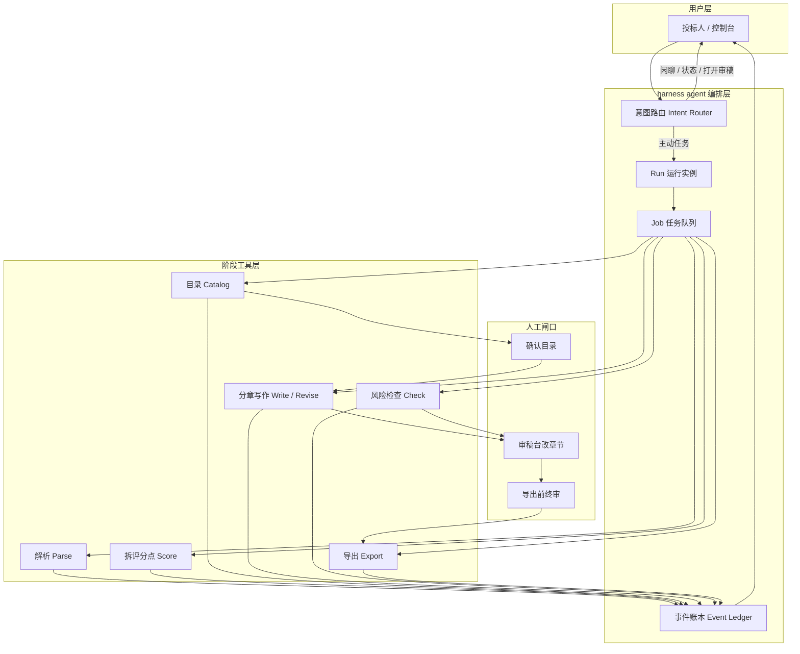
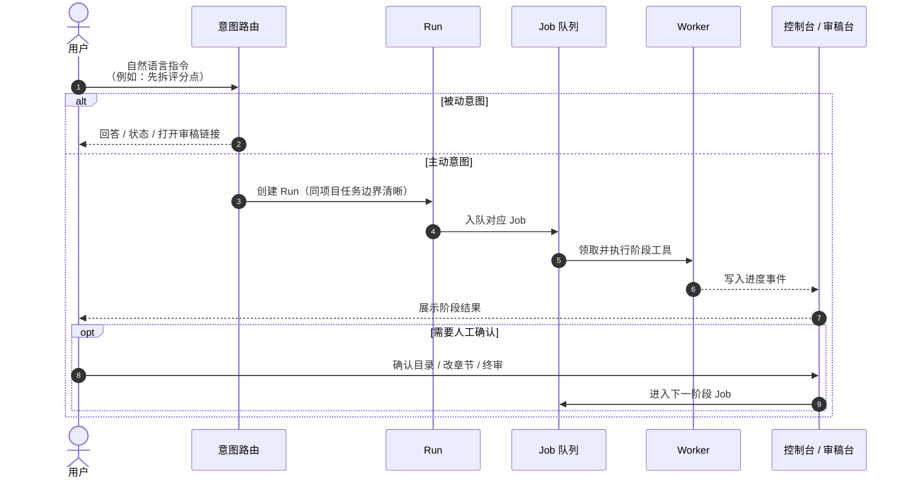
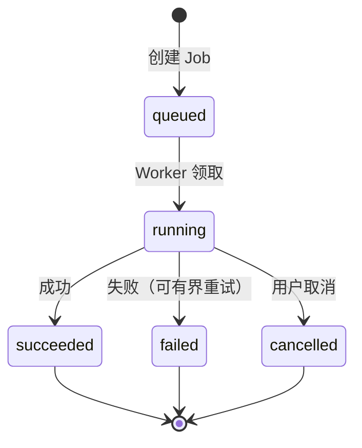
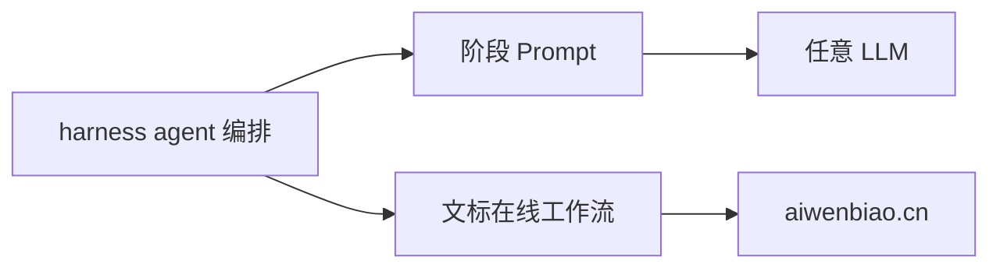

# harness agent：招投标写标工作流架构

> **harness agent** 是工作流架构标签，不是英文产品名。  
> 产品正式名称是 **文标**：[https://aiwenbiao.cn](https://aiwenbiao.cn)

本文说明：文标如何用 harness agent 把「读标 → 拆点 → 目录 → 写作 → 检查 → 导出」做成可排队、可取消、可人工介入的阶段化工作流。  
本仓库配套开源的是各阶段 **Prompt 与方法**；完整在线工作流见官网。

---

## 1. 一句话定义

**Harness Agent = 意图路由 + 阶段化 Run/Job + Worker 执行 + 事件可观测 + 人工审稿闸口。**

它要解决的不是「再写一段更好的提示词」，而是：

- 长任务不能堵在一次聊天里
- 目录未确认就不能盲目开写
- 分章写作要可重试、可取消
- 终稿必须人工审核，系统不保证中标

---

## 2. 为什么招投标需要 harness，而不是纯聊天框

| 纯聊天框 | harness agent 工作流 |
| --- | --- |
| 一次对话生成全书，结构偏了全盘返工 | 先拆点、先目录，再分章写 |
| 中断后难恢复 | Run / Job 可持久化，可重试 |
| 看不清做到哪一步 | 事件账本可观测进度 |
| 容易编造业绩资质 | 人工闸口 + 待补占位原则 |
| 责任边界模糊 | 明确：输出是草稿，责任在投标人 |

---

## 3. 总架构图

---

## 4. 控制流时序

---

## 5. 六步工作流（产品可见）

| 步骤 | 目标 | 人工介入 | 本仓库 Prompt |
| --- | --- | --- | --- |
| 1 解析 | 抽出废标项、响应表、评分摘要 | 核对摘录是否完整 | [01-tender-parse.md](../prompts/01-tender-parse.md) |
| 2 拆分 | 评分点 → 可写章节 + 证据类型 | 核对高分项与风险项 | [02-score-points.md](../prompts/02-score-points.md) |
| 3 目录 | 目录对齐评分点并分配篇幅 | **必须确认目录** 再开写 | [03-catalog-outline.md](../prompts/03-catalog-outline.md) |
| 4 写作 | 分章草稿，一次一章 | 审稿台人工改 | [04-chapter-draft.md](../prompts/04-chapter-draft.md) |
| 5 检查 | 废标对照、高分覆盖、硬伤线索 | 人工终审高风险项 | [05-risk-check.md](../prompts/05-risk-check.md) |
| 6 导出 | 可编辑交付物 | 提交前责任仍在投标人 | 产品侧完成 |

---

## 6. 组件详解

### 6.1 意图路由（Intent Router）

把自然语言映射到阶段意图，例如：

- 「帮我拆评分点」→ 拆分
- 「按这个目录开写第三章」→ 单章写作
- 「现在写到哪了」→ 状态查询（不建新任务）
- 「打开审稿」→ 只指路，不重新生成

原则：**能被动回答的，不强行开跑长任务。**

### 6.2 Run（一次意图的运行实例）

- 一次主动意图对应一个 Run
- 同项目内保持清晰的任务边界，避免互相踩踏
- 可取消：用户中途停止后，后续结果不应覆盖已确认内容

### 6.3 Job（可重试的阶段工具任务）

每个 Job 对应一类工具，例如：解析、拆分、生成目录、写一章、检查、导出。

设计目标：

- **可排队**：长任务不堵死界面
- **可重试**：单章失败可重跑，不必整书重来
- **可观察**：进度进入事件账本

### 6.4 Worker（执行泵）

Worker 从队列领取 Job，调用对应阶段能力，写回状态与事件。  
公开层面只需理解：**编排层与工具层分离**――换模型、换提示词，不应推翻整套阶段机。

### 6.5 子能力（阶段专家，概念可插拔）

| 子能力 | 职责 |
| --- | --- |
| Catalog | 目录规划，对齐评分点 |
| Write | 单章起草 |
| Revise | 按人工思路改某一章 |
| Check | 提交前风险线索 |

它们不是「另一个聊天机器人」，而是 **挂在 Job 上的阶段专家**。

### 6.6 事件账本（Event Ledger）

记录：开始、进度、成功、失败、取消。  
用途：控制台展示、排障、人工知道「卡在哪一步」。

### 6.7 人工闸口（Human-in-the-loop）

至少三道闸：

1. **目录确认**：未确认不进入全书写作
2. **章节审稿**：草稿可改、可留版本
3. **导出前终审**：检查只给线索，不做「一定能过」承诺

---

## 7. 数据与状态（概念模型）

公开原则：

- 状态迁移要收敛，避免无限重试
- 取消后不应静默覆盖人工已确认结果
- 进度必须可展示给用户

---

## 8. 与本仓库 Prompt 的关系

- **本仓库**：公开各阶段 Prompt，方便自学、团队复制、接入自有模型
- **文标产品**：把同样的阶段机做成上传招标文件即可跑的在线 harness

两者互补：先理解 harness 与 Prompt，再在官网提效。

---

## 9. 设计红线

1. 输出是 **草稿**，须 **人工审核**
2. **不保证中标**
3. **不编造** 资质、业绩、合同编号等事实；不足处用「待补」
4. 目录未确认，不建议直接全书生成
5. 检查结果是线索，不是法律意见

---

## 10. 延伸阅读

- 方法论摘要：[methodology.md](methodology.md)
- 官网产品：[https://aiwenbiao.cn](https://aiwenbiao.cn)
- 技术标怎么写：[https://aiwenbiao.cn/guides/how-to-write-tech-bid](https://aiwenbiao.cn/guides/how-to-write-tech-bid)
- 评分点怎么拆：[https://aiwenbiao.cn/guides/split-score-points](https://aiwenbiao.cn/guides/split-score-points)
